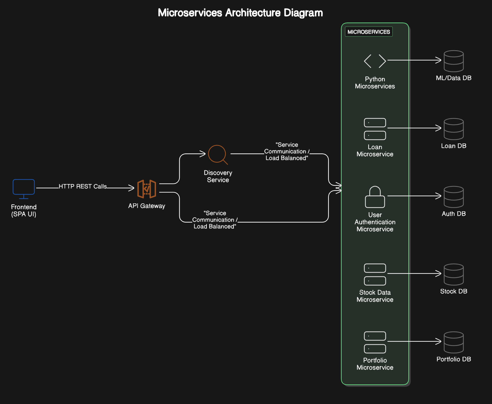

# 💸 LendNova - Smart Financial Lending Platform

### 🚀 Developed by: Faldu Arpit, Madariya Kanji, Parmar Dharmik, Vekariya Vasu

---

## 🧠 Overview

*LendNova* is an intelligent lending platform that enables users to borrow loans against their investment securities, with a unified dashboard for portfolio management. Lenders benefit from AI-powered risk assessment, real-time collateral monitoring, and predictive insights.

🔧 **Built using Microservice Architecture** — ensuring scalable, maintainable, and independent service deployment for core modules like Portfolio Management, Loan Processing, ML Risk Analysis, and Collateral Monitoring.

---

## 🖼️ System Architecture

---

## 🛠 Tech Stack

- *Architecture*: **Microservice-Based**
- *Frontend*: ReactJS  
- *Backend*: Java (Spring Boot)  
- *Database*: MongoDB  
- *Machine Learning*: Python-based models for risk prediction & sentiment analysis  

---

## 🔍 Problems We Solve

### 🔓 For Borrowers:
- Loans without selling investments
- Instant loan eligibility check via portfolio data
- Fast & transparent loan approvals
- Centralized dashboard for both portfolio and loans

### 🔐 For Lenders:
- ML-based Financial Trust Score for borrowers
- Real-time Loan-to-Value (LTV) monitoring
- Market-based risk alerts and prediction models
- Actionable signals based on news sentiment & technical indicators

---

## 🌟 Key Features

### 📊 Portfolio Management
- Centralized view of stocks, mutual funds, ETFs
- Historical trends, gains/losses, asset allocation

### 💰 Loan Against Securities (LAS)
- Borrow without liquidating assets
- Digital pledge, safe LTV calculation

### 📈 Financial Trust Score
- Reflects user's investment habits and credibility
- Updated in real-time based on actions

### 🧮 ML-Based Loan Risk Assessment
- Inputs: portfolio data, borrowing history, market exposure
- Dynamic risk scoring & interest rate adjustment

### 📰 Sentiment & Market Trend Analysis
- Detects news sentiment and price volatility
- Helps anticipate market impacts on pledged assets

### 🔔 Post-Loan Collateral Monitoring
- Tracks LTV in real-time
- Automated alerts for margin call conditions

---

## 🔧 How It Works

1. *User Dashboard*: Buy/sell stocks, manage portfolio, view transaction history.
2. *Financial Trust Score*:
   - Starts at 50 (range 0–100)
   - +5 for profit, -3 for loss
3. *Loan Application*:
   - Choose lender based on LTV, interest rate
   - Get suggestions on safe loan limits
4. *Lender Dashboard*:
   - See ML-driven insights: trust score, predictions, ratings
   - Approve/reject based on internal criteria
5. *ML Models*:
   - *Fundamental Analysis*
   - *Short-Term Technicals* (e.g., RSI, MACD, Bollinger Bands)
   - *Long-Term Indicators* (e.g., EMA crossovers)
6. *Collateral Monitoring*:
   - Alerts during sharp market drops
   - Margin call options: buy more or deposit funds
7. *Post-Repayment*:
   - Securities returned to borrower

---

## 🧠 Future Enhancements

- Integrate more asset classes (e.g., crypto, bonds)
- Expand lender scoring algorithms
- Mobile app development

---

> Empowering liquidity without compromise. — LendNova
